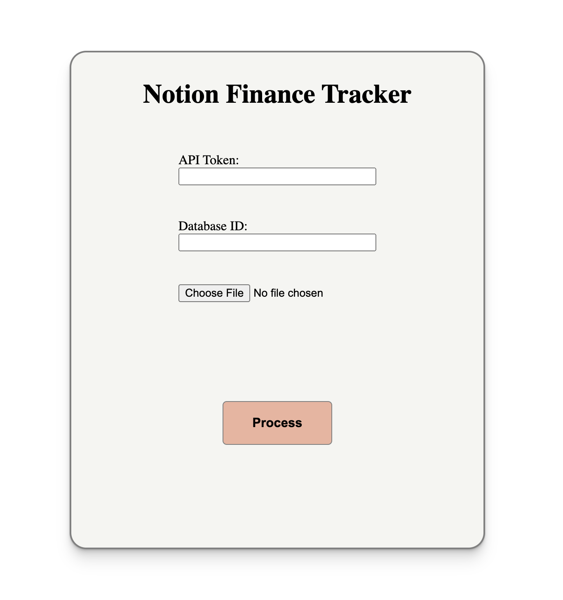
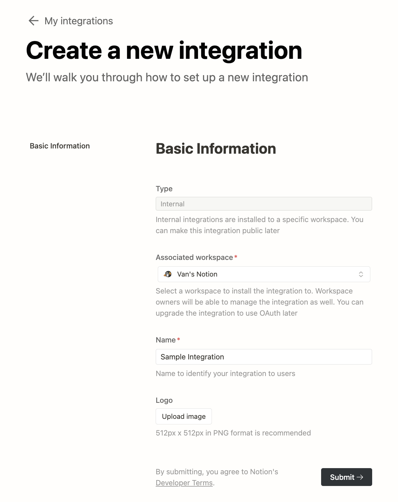
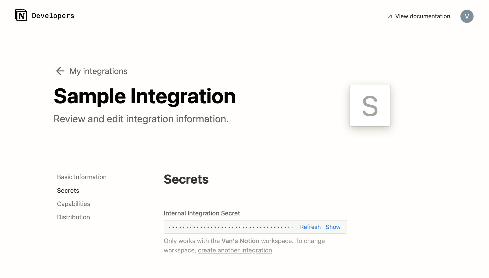
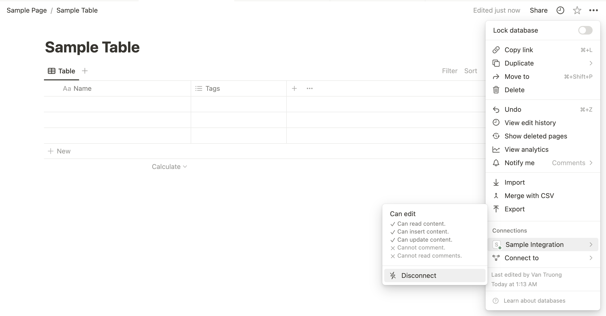

# Notion Financial Tracker :chart_with_upwards_trend:

Help users streamline their monthly budgeting by automating the creation of spending transactions.

## Description :memo:

Notion has gained popularity as a versatile tool for organizing various aspects of everyday life. One common use is for tracking personal finances. However, manually creating an entry in Notion's table database for every transaction can be incredibly tedious. This project seeks to simplify and automate the process of creating these entries, making it easier for users to manage their finances effectively.

See it in action in this [demo video](https://youtu.be/yFkf1rmnOvI)!

User interface after integrating React:



## Getting Started :hammer:

A few things are required in order to use this application.

### Obtain Notion Secret :closed_lock_with_key:

1. Navigate to https://developers.notion.com/ and click "View my integrations" in the upper right corner. Log in if needed.
    
    > **_NOTE:_** if you are taken to your workspace after logging in, simply repeat step 1.

2. Click on `New integration`

3. Select the desired workspace, give a name to identify the integration

    

4. After clicking `Submit ->`, you will see your Internal Integration Secret

    

5. Leave page open for now

### Integrate with Notion Database :electric_plug:

1. Go to or create a database you would like to use for this application

2. On the page where the databse lives, click the 3-dot menu on the upper right corner

3. Scroll down to "Connections", search for and select the newly created integration

4. The integration should show up under "Connections" now

    

5. Click on 3-dot menu of the database and click "Copy link to view"

6. Paste it on the page or any text editor and copy the string between "/" and "?" to obtain the database ID

### Environment Variables :palm_tree:

1. Create a `.env` file at root directory of the cloned project

2. Create an env variable and paste the database ID. For example:

    ```NOTION_DATABASE_ID=1234567890abcdefg```

3. Go back to newly created integration page, click show and copy Notion Secret

4. Create an env variable and paste the secret key. For example:

    ```NOTION_SECRET=<secret_super secretive notion secret>```

> **_NOTE:_** an optional variable `PORT` can be set in the `.env` file. If not set, then default will be port 3000.

## Technologies :toolbox:

* React
* React Styled Components
* Typescript
* Express
* Node
* Notion
