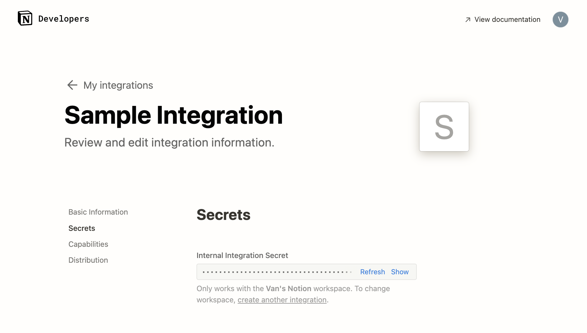

## Server Setup

Steps to set up environment variables and integrate with Notion.

### Obtain Notion Secret :closed_lock_with_key:

1. Navigate to https://developers.notion.com/ and click "View my integrations" in the upper right corner. Log in if needed.
    
    > **_NOTE:_** if you are taken to your workspace after logging in, simply repeat step 1.

2. Click on `New integration`

3. Select the desired workspace, give a name to identify the integration

    

4. After clicking `Submit ->`, you will see your Internal Integration Secret

    

5. Leave page open for now

### Integrate with Notion Database :electric_plug:

1. Go to or create a database you would like to use for this application. At this stage of the project, please make sure the database has the following fields:

    a. Description - text property

    b. Category - select property with labels `Food & Drinks`, `Shopping`, `Bills & Utilities`, and `Groceries`

    c. Amount - number property (select the appropriate currency)

    d. Date - date property

    e. Memo - text property

2. On the page where the database lives, click the 3-dot menu on the upper right corner

3. Scroll down to "Connections", search for and select the newly created integration

4. The integration should show up under "Connections" now

    

### Environment Variables :palm_tree:

1. Create a `.env` file at root directory of the cloned project

2. Go back to newly created integration page, click show and copy Notion Secret

3. Create an env variable and paste the secret key. For example:

    ```NOTION_SECRET=<secret_super-secretive-notion-secret>```

> **_NOTE:_** an optional variable `PORT` can be set in the `.env` file. If not set, then default will be port 3000.
